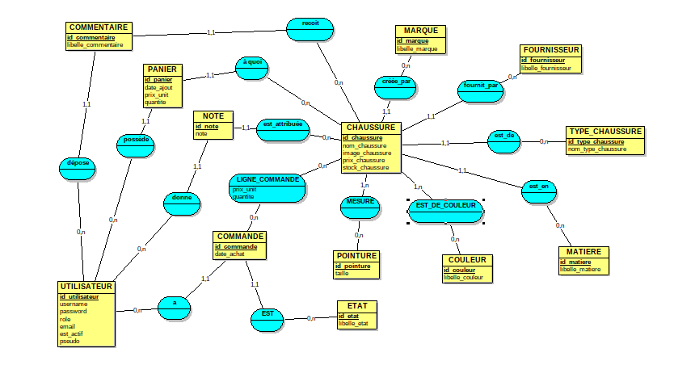
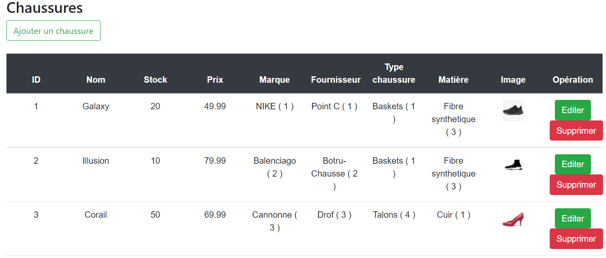

# **BUILDING AN ECOMMERCE WEBSITE 🥾**

This repertoire brings together the work of ABEL Léna, DUBOL Lucas, PICOT Nicolas and TOILLON Samuel.

pythonanywhere link: http://sae204adpt.pythonanywhere.com/

## **WHAT IS THIS PROJECT?**

This project consists of the creation of a website for the sale of shoes (Flask, HTML, JavaScript, CSS), creating and managing a database (MySQL) and putting it online on a virtualized server (Linux, Git, Apache, virtual machine)

## What are the productions of this project?

- 🔍 Study of data and visualization of information
- 📊 Data model
- 📝 Oral presentation of results in English
- 📈 Database creation script
- 🖥️ Interfaces to add/modify/delete data. Interfaces for viewing information

## Conceptual data model

------------------------------------------------------------------------------

## MY ROLE

The admin is capable of multiple thing.

### **Order management**
&ensp;Admin can view orders placed by X customers, view order details by clicking on desired order. (shoe ordered, date of order, total price) Thanks to the validate button, the admin will therefore validate an order from a customer who will then be validated in the customer's orders.

### **Customer management**
&ensp;In this section, the admin is able to view all registered users on his website. The admin can then view the user's name, email, role and if this user is active.

### **Shoes management**
&ensp;In this part several information are stored.

1. Store shoes
2. Types of shoes that exist
3. Dataviz on shoes/shoe types

&ensp;In the shoes management section, the admin can add a new shoe.

But also edit a shoe information.

Then remove this shoe if necessary.

Here is the end result:

### **Type of shoes management**

Its principle is in itself the same as the management of shoes except that this page manages the management of the types of shoes. It looks like this:

### **Details (dataviz) of the shoes**

 This part allows the admin to have a data visualization on his site thanks to charters. I was then able to develop them in JavaScript:
 
 
 
 
 
